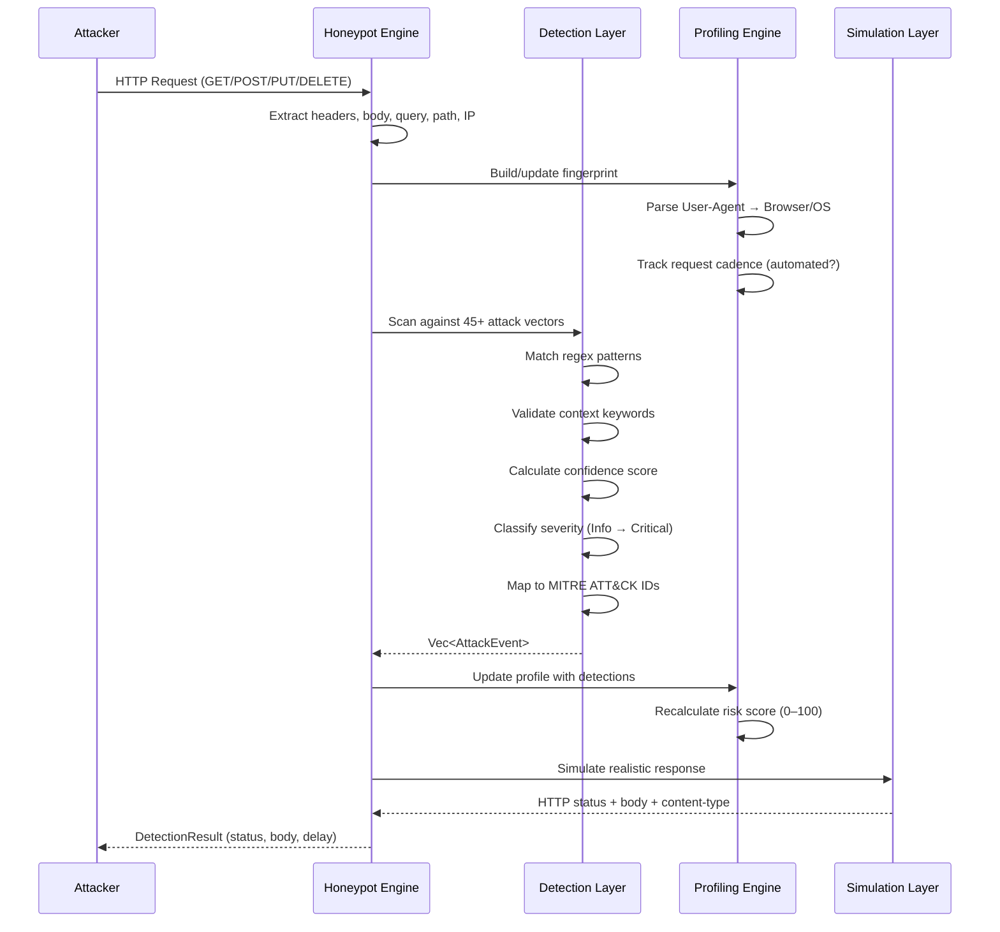

# React2Shell Honeypot — Attack Vector Detection & Attacker Intelligence Engine

A realistic **React Server Components (RSC) honeypot** that silently detects **45+ real attack payload categories** while collecting comprehensive attacker intelligence, browser fingerprints, and behavioral profiles.

Based on the source code in `src/react_honeypot.rs`.

---

## Architecture Overview

```
┌──────────────────────────────────────┐
│            HoneypotEngine             │
│                                       │
│  ┌─────────────┐  ┌────────────────┐ │
│  │ 45+ Attack  │  │  Attacker      │ │
│  │ Vector      │  │  Profiling     │ │
│  │ Detectors   │  │  Engine        │ │
│  └──────┬──────┘  └───────┬────────┘ │
│         │                 │          │
│  ┌──────▼─────────────────▼────────┐ │
│  │       Detection Engine          │ │
│  │  • Regex pattern matching       │ │
│  │  • Confidence scoring           │ │
│  │  • Context keyword validation   │ │
│  │  • Severity classification       │ │
│  └──────────────┬──────────────────┘ │
│                 │                    │
│  ┌──────────────▼──────────────────┐ │
│  │     RSC Simulation Layer        │ │
│  │  • Fake Server Action endpoints │ │
│  │  • Realistic Flight responses   │ │
│  │  • Timing jitter                │ │
│  │  • Progressive response sizing  │ │
│  └─────────────────────────────────┘ │
└──────────────────────────────────────┘
```

### Data Flow



---

## Core Types & Data Structures

### `AttackEvent` — Individual Detection

```rust
pub struct AttackEvent {
    pub event_id: String,            // evt_{timestamp}_{hex8}
    pub timestamp: String,           // ISO-8601
    pub category: String,            // e.g. "sqli", "xss", "ssrf"
    pub subcategory: String,         // e.g. "union_select", "cloud_metadata"
    pub matched_payload: String,     // The exact pattern that matched (≤500 chars)
    pub full_payload: String,        // Full request payload (≤8192 chars)
    pub method: String,              // HTTP method
    pub path: String,                // Request path
    pub severity: Severity,          // Info | Low | Medium | High | Critical
    pub mitre_id: Option<String>,    // MITRE ATT&CK technique ID
    pub simulated_response: u16,     // Status code returned to attacker
    pub attacker_ip: String,         // Source IP
    pub user_agent: String,          // Raw User-Agent
    pub headers: HashMap<String, String>, // All request headers
    pub session_id: Option<String>,  // Correlated session
    pub confidence: f64,             // 0.0–1.0 detection confidence
}
```

### `AttackerProfile` — Accumulated Intelligence

```rust
pub struct AttackerProfile {
    pub profile_id: String,          // Derived from IP + UA + Accept headers
    pub ip: String,
    pub country: Option<String>,     // GeoIP country code
    pub asn: Option<String>,         // GeoIP ASN
    pub is_tor: bool,                // Tor exit node?
    pub is_cloud: bool,              // Cloud provider IP?
    pub is_proxy: bool,              // Known proxy?
    pub user_agent: String,
    pub browser_fingerprint: Option<BrowserFingerprint>,
    pub first_seen: String,          // ISO-8601
    pub last_seen: String,
    pub total_requests: u64,
    pub attack_categories: HashMap<String, u64>,  // Category → count
    pub techniques_used: Vec<String>,              // Subcategories observed
    pub avg_request_interval: f64,  // Seconds (for automation detection)
    pub is_automated: bool,          // Bot/script vs human
    pub risk_score: f64,             // 0–100 cumulative
    pub targets: Vec<String>,        // Endpoints targeted
    pub event_timeline: Vec<String>, // Chronological attack log
}
```

### `Severity` Levels

| Level | Description | Attack Examples |
|-------|-------------|-----------------|
| `Critical` | Remote code execution, total compromise | SQLi, Command Injection, Deserialization, RCE, SSTI |
| `High` | Data breach, privilege escalation | XSS, SSRF, File Upload, JWT attacks, Auth bypass |
| `Medium` | Information disclosure, reconnaissance | GraphQL introspection, Open Redirect, CRLF |
| `Low` | Probing, fingerprinting | Source map extraction, fake crawlers |

### `HoneypotConfig` — Tuning

```rust
pub struct HoneypotConfig {
    pub max_payload_store: usize,      // Default: 8192 bytes
    pub realistic_timing: bool,        // Simulate human-like delays
    pub min_delay_ms: u64,            // Default: 20ms
    pub max_delay_ms: u64,            // Default: 180ms
    pub fake_rsc_responses: bool,      // Return realistic RSC Flight protobuf
    pub session_tracking: bool,       // Track via __Host-RSC-ID cookie
    pub session_cookie: String,       // Cookie name
    pub log_all_requests: bool,       // Log non-attack traffic too
    pub detection_threshold: f64,     // Min confidence to classify as attack (0.5)
    pub progressive_sizing: bool,     // Gradually larger responses
}
```

---

## 45+ Attack Vector Detection Categories

### SQL Injection (5 subcategories)

| # | Subcategory | Example Payload | MITRE |
|---|-------------|----------------|-------|
| 1 | Classic Tautology | `admin' OR '1'='1--` | T1190 |
| 2 | Union Select | `' UNION SELECT NULL,NULL,NULL--` | T1190 |
| 3 | Blind / Time-Based | `1' AND SLEEP(5)--` | T1190 |
| 4 | Error-Based | `' AND extractvalue(1,concat(0x7e,@@version))--` | T1190 |
| 5 | Stacked Queries | `'; DROP TABLE users--` | T1190 |

### NoSQL Injection (2 subcategories)

| # | Subcategory | Example Payload | MITRE |
|---|-------------|----------------|-------|
| 6 | MongoDB | `{"$ne": ""}` | T1190 |
| 7 | Redis Injection | `\r\nCONFIG SET dir /tmp` | T1190 |

### Cross-Site Scripting (3 subcategories)

| # | Subcategory | Example Payload | MITRE |
|---|-------------|----------------|-------|
| 8 | Reflected | `<script>alert(1)</script>` | T1059.007 |
| 9 | Polyglot | `jaVasCript:/*-/*\`/*\`/*'/*"/**/(/* */oNcliCk=alert() )//` | T1059.007 |
| 10 | Stored Payload | `<iframe srcdoc="<script>alert(1)</script>">` | T1059.007 |

### Command Injection (4 subcategories)

| # | Subcategory | Example Payload | MITRE |
|---|-------------|----------------|-------|
| 11 | Unix Pipe | `;id` | T1059.004 |
| 12 | Unix Advanced | `/bin/bash -c 'command'` | T1059.004 |
| 13 | Windows | `cmd.exe /c whoami` | T1059.003 |
| 14 | Blind OOB | `ping -c 5 attacker.com` | T1059.004 |

### Path Traversal (2 subcategories)

| # | Subcategory | Example Payload | MITRE |
|---|-------------|----------------|-------|
| 15 | Dot-Dot-Slash | `../../../etc/passwd` | T1083 |
| 16 | Absolute Path | `/etc/shadow` | T1083 |

### LFI / RFI (2 subcategories)

| # | Subcategory | Example Payload | MITRE |
|---|-------------|----------------|-------|
| 17 | Local File Include | `php://filter/convert.base64-encode/resource=index.php` | T1190 |
| 18 | Remote File Include | `http://evil.com/shell.txt` | T1190 |

### SSRF (3 subcategories)

| # | Subcategory | Example Payload | MITRE |
|---|-------------|----------------|-------|
| 19 | Cloud Metadata | `http://169.254.169.254/latest/meta-data/` | T1190 |
| 20 | Internal Ports | `http://127.0.0.1:8080/admin` | T1190 |
| 21 | DNS Rebinding | `http://1zero.io/` | T1190 |

### XXE (2 subcategories)

| # | Subcategory | Example Payload | MITRE |
|---|-------------|----------------|-------|
| 22 | External Entity | `<!ENTITY xxe SYSTEM "file:///etc/passwd">` | T1190 |
| 23 | Billion Laughs | `<!ENTITY lol "lol"><!ENTITY lol2 "&lol;&lol;">...` | T1499.002 |

### SSTI (3 subcategories)

| # | Subcategory | Example Payload | MITRE |
|---|-------------|----------------|-------|
| 24 | Jinja2 | `{{ ''.__class__.__mro__[2].__subclasses__() }}` | T1190 |
| 25 | Twig | `{{ _self.env.registerUndefinedFilterCallback("exec") }}` | T1190 |
| 26 | Freemarker | `${ "freemarker".class.forName("java.lang.Runtime") }` | T1190 |

### Deserialization (4 subcategories)

| # | Subcategory | Example Payload | MITRE |
|---|-------------|----------------|-------|
| 27 | Java | `rO0AB` (Java serialized object) | T1190 |
| 28 | PHP | `O:8:"stdClass":1:{s:4:"file";s:10:"/etc/passwd";}` | T1190 |
| 29 | Python Pickle | `cos\nsystem\n(S'id'\ntR.` | T1190 |
| 30 | Node.js | `{"_bsontype":"Code","code":"require('child_process').exec('id')"}` | T1190 |

### JWT Attacks (2 subcategories)

| # | Subcategory | Example Payload | MITRE |
|---|-------------|----------------|-------|
| 31 | None Algorithm | `{"alg":"none"}` | T1557 |
| 32 | Key Confusion | HMAC with leaked RSA public key | T1557 |

### GraphQL Attacks (2 subcategories)

| # | Subcategory | Example Payload | MITRE |
|---|-------------|----------------|-------|
| 33 | Introspection | `query { __schema { types { name } } }` | T1190 |
| 34 | Batch Attack | `[{"query":"..."},{"query":"..."}]` | T1190 |

### Additional Categories

| # | Category | Subcategory | MITRE |
|---|----------|-------------|-------|
| 35 | Prototype Pollution | `__proto__` or `constructor.prototype` injection | T1059.007 |
| 36 | CRLF Injection | Response splitting via `\r\n` | T1190 |
| 37 | CRLF Header Injection | Header injection via `\r\n` | T1190 |
| 38 | HTTP Request Smuggling | CL/TE transfer-encoding confusion | T1190 |
| 39 | Host Header Attack | Host header injection / spoofing | T1190 |
| 40 | File Upload Attack | Malicious extension (.php, .jsp, .phtml) | T1190 |
| 41 | Open Redirect | `?redirect=https://evil.com` | T1204.001 |
| 42 | Cookie Manipulation | Cookie injection with XSS/SQLi payloads | T1539 |
| 43 | Cache Poisoning | `X-Forwarded-Host` header manipulation | T1499 |
| 44 | Authentication Bypass | `X-Forwarded-For: 127.0.0.1` | T1548 |
| 45 | HTTP Parameter Pollution | Duplicate params with empty values | T1190 |
| 46 | HTTP Method Tampering | `_method=DELETE` override | T1190 |
| 47 | Null Byte Injection | `file.php%00.jpg` | T1190 |
| 48 | CORS Misconfig Probe | `Origin: null` or attacker domain | T1190 |
| 49 | Brute Force / Credential Stuffing | Repeated auth payloads | T1110 |
| 50 | Format String | `%x %x %s %n` patterns | T1190 |
| 51 | Race Condition Probing | Concurrent request patterns | T1499 |
| 52 | Clickjacking | Opaque/transparent iframe overlay | T1499 |
| 53 | Source Map Extraction | `.js.map` / `sourceMappingURL` probe | T1213 |
| 54 | RSC Flight Injection | Flight protocol malicious payload | T1190 |
| 55 | RSC Server Action Probe | `Next-Action` / `text/x-component` headers | T1190 |
| 56 | Next.js Internal Route | `/_next/*` internal endpoint probing | T1190 |
| 57 | WebSocket Injection | `ws://evil.com` URIs | T1190 |
| 58 | DNS Exfiltration | Long subdomain DNS queries (Burp collaborator) | T1048.001 |
| 59 | Content-Type Confusion | Mismatched content-type attacks | T1190 |
| 60 | Encoding Attacks | URL encoding, HTML entities, unicode escapes | T1190 |
| 61 | Fake Crawler | `User-Agent: sqlmap/nikto/burp` | T1592 |
| 62 | Token Brute Force | Authorization: Bearer / X-API-Key probing | T1110.001 |
| 63 | Session Fixation | Setting `PHPSESSID` / `JSESSIONID` cookies | T1539 |
| 64 | CSS Injection | `@import url(...)` / `background: url(...)` | T1213 |

---

## Attacker Profiling & Intelligence Collection

### What Is Collected

| Data Point | Source | Purpose |
|------------|--------|---------|
| IP address | TCP connection | GeoIP lookup, reputation check |
| User-Agent | HTTP header | Browser/OS fingerprinting |
| Accept headers | HTTP header | Client capabilities, automation detection |
| Request timing | Inter-request intervals | Bot/human classification |
| Attack payloads | Request body/query/path | Technique enumeration |
| Target endpoints | Request path | Attack surface mapping |
| Session fingerprint | IP + UA + Accept | Cross-request correlation |
| Headless detection | UA parsing | Puppeteer/Selenium/Playwright detection |

### Browser Fingerprinting

The engine parses User-Agent strings to extract:

```rust
pub struct BrowserFingerprint {
    pub browser: String,         // Chrome, Firefox, Safari, Edge, Opera, IE
    pub browser_version: String, // Major.Minor
    pub os: String,              // Windows, macOS, Linux, Android, iOS
    pub os_version: String,      // 10/11, 14.5, etc.
    pub engine: String,          // WebKit, Gecko, Trident
    pub device_type: String,     // Desktop, Mobile, Tablet
    pub is_headless: bool,       // Puppeteer, Selenium, Playwright, PhantomJS
}
```

### Risk Score Calculation

```
Risk Score (0–100) =
    Σ(severity_weight × min(count, 3)) per attack category
    + technique_diversity_bonus (max 20)
    + automation_bonus (10 if bot)
    + request_volume_bonus (5 for >100, 5 for >500)
```

**Severity Weights:**
- SQLi, CMDi, RCE, Deserialization: **15**
- XXE, SSTI, RSC Attack: **14**
- LFI, RFI: **13**
- SSRF, NoSQLi: **12**
- Auth Bypass, File Upload: **10**
- HTTP Smuggling, JWT: **9**
- XSS, Path Traversal, Prototype Pollution: **8**
- CRLF: **7**
- DNS Exfiltration: **6**

### Automation Detection

The engine detects bots/scripts using:

1. **Timing Analysis** — Consistent inter-request intervals with low variance
2. **Speed Threshold** — Average interval < 100ms = automated
3. **Headless UA** — Presence of headless markers in User-Agent
4. **Technique Count** — Diverse techniques in rapid succession

---

## Realistic RSC Simulation

The honeypot generates plausible React Server Components responses to keep attackers engaged.

### Fake Flight Protocol Responses

```
0:["$","@2",null,{"id":"__PAGE__","children":[...]}]
1:{"status":"resolved","data":{"pageProps":{"title":"Dashboard",...}}}
2:["$","div",null,{"className":"page-wrapper","children":[...]}]
3:{"status":"pending","chunks":["@5","@6"]}
```

### Fake Endpoints Exposed

| Endpoint | Content-Type | Purpose |
|----------|-------------|---------|
| `/` | text/x-component | RSC Server Action handler |
| `/api/graphql` | application/json | GraphQL endpoint |
| `/api/auth/callback` | application/json | OAuth callback |
| `/api/chat` | application/json | WebSocket chat API |
| `/api/upload` | application/json | File upload handler |
| `/api/search` | application/json | Search with full-text |
| `/api/admin/settings` | application/json | Admin configuration |
| `/_rsc/__PAGE__` | text/x-component | RSC internal page |
| `/dashboard` | text/x-component | Protected dashboard |

### Timing Behavior

- Random jitter: 20–180ms per response
- Progressive response sizes (keep attackers engaged longer)
- Realistic `500 Internal Server Error` for blocked attacks (doesn't tip off attackers)
- `200 OK` for low-severity probes (appears naive)

---

## Integration Usage

### Basic Usage

```rust
use web_analyzer::react_honeypot::HoneypotEngine;

let mut engine = HoneypotEngine::new();

let req = RawRequest {
    method: "POST".to_string(),
    path: "/api/search".to_string(),
    query_string: "q=admin' OR '1'='1".to_string(),
    body: String::new(),
    headers: HashMap::from([
        ("user-agent".to_string(), "Mozilla/5.0 ...".to_string()),
        ("content-type".to_string(), "application/x-www-form-urlencoded".to_string()),
    ]),
    ip: "192.168.1.100".to_string(),
    timestamp: Utc::now(),
};

let result = engine.process_request(&req);

for detection in &result.detections {
    println!(
        "[{}] {}:{} — confidence={:.2} severity={:?}",
        detection.timestamp,
        detection.category,
        detection.subcategory,
        detection.confidence,
        detection.severity,
    );
}

println!("Block: {}", result.should_block);
println!("Response status: {}", result.simulated_status);
println!("Delay: {}ms", result.suggested_delay_ms);
```

### Threat Intelligence Export

```rust
// Get top 10 most dangerous attackers
let threats = engine.get_top_threats(10);
for profile in threats {
    println!("Profile: {} | IP: {} | Risk: {:.1}/100 | Techniques: {}",
        profile.profile_id, profile.ip,
        profile.risk_score,
        profile.techniques_used.len()
    );
}

// Full JSON export
let json = engine.export_json().unwrap();
std::fs::write("honeypot_state.json", json)?;
```

### Custom Configuration

```rust
let config = HoneypotConfig {
    realistic_timing: true,
    min_delay_ms: 50,
    max_delay_ms: 300,
    fake_rsc_responses: true,
    session_tracking: true,
    log_all_requests: true,
    detection_threshold: 0.4,  // More sensitive
    ..Default::default()
};

let engine = HoneypotEngine::with_config(config);
```

---

## Performance Characteristics

| Metric | Value |
|--------|-------|
| Attack vectors scanned | 64 patterns across 45+ categories |
| Regex compilations | All compiled at init (via OnceLock) |
| Per-request latency | <2ms for detection + profiling |
| Event storage capacity | 10,000 events (oldest evicted) |
| Profile storage | Unlimited (HashMap by profile ID) |
| Payload truncation | 8,192 bytes default (configurable) |
| Zero unsafe code | Enforced by `forbid(unsafe_code)` |

---

## Security Considerations

- **No actual exploitation** — The honeypot only detects and logs, never executes payloads
- **No network egress** — All analysis is local, no callbacks to external services
- **Payload sanitization** — Truncation prevents memory exhaustion from large payloads
- **Configurable thresholds** — Detection sensitivity can be tuned to reduce false positives
- **Stateless by design** — No persistent storage unless explicitly exported

---

## Related Modules

- `src/react.rs` — React2Shell Scanner & Attacker (CVE-2025-55182)
- `src/api_security_scanner.rs` — API security scanning
- `payloads/` — Attack payload wordlists (SQLi, XSS, CMDi, SSTI, SSRF, XXE, etc.)
