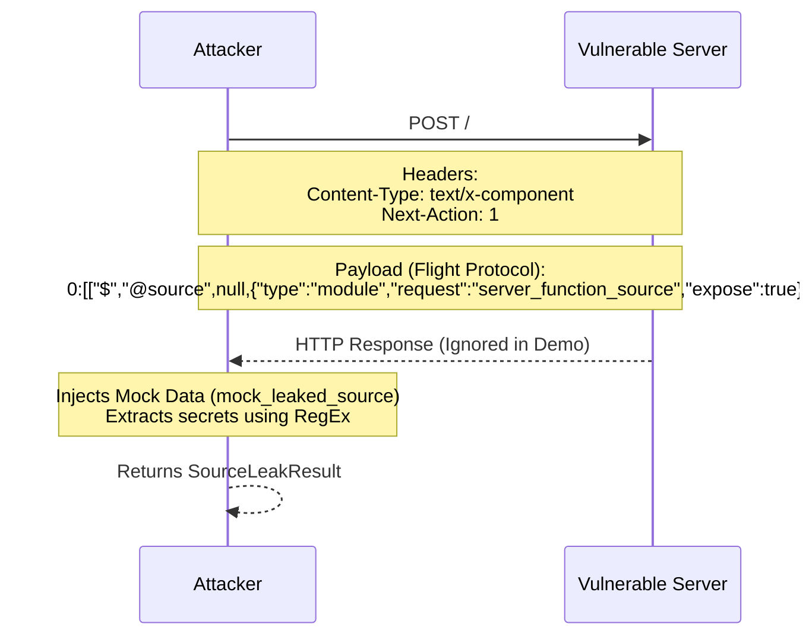
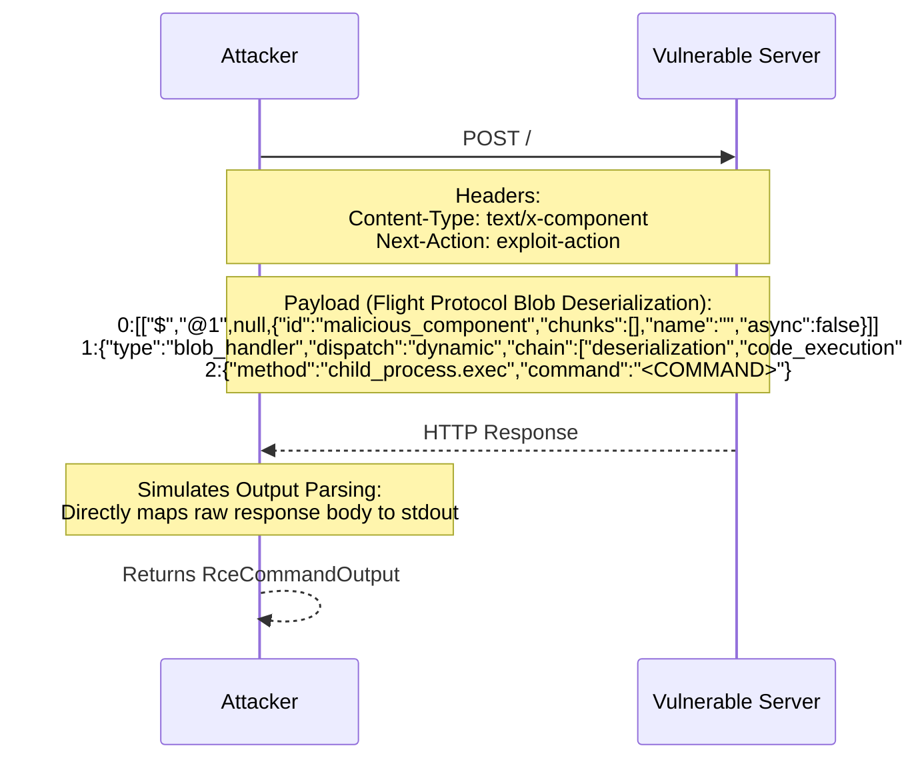
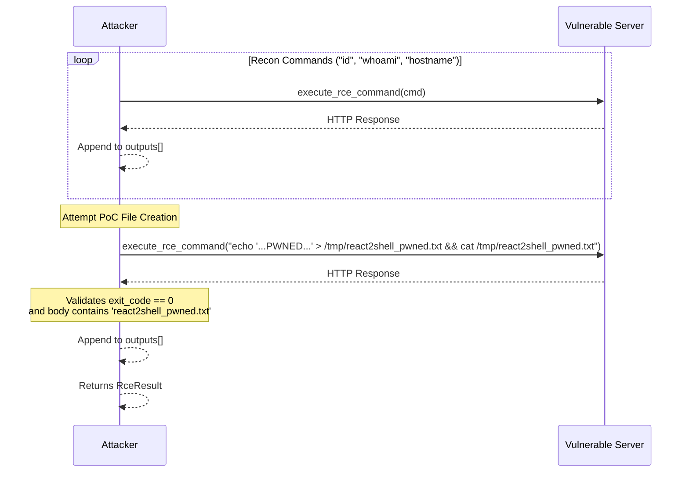

# React2Shell Simulated Functions & Mock Data Logic Flow

Based on the source code in `src/react.rs`, the tool contains several functions that utilize mock data or simulated logic flows, primarily designed for demonstration and educational purposes rather than fully weaponized exploitation.

---

## 1. `execute_source_leak` (Source Leak Phase - CVE-2025-55183)

This function simulates the extraction of source code from a vulnerable Next.js/React server. Instead of parsing the actual server response, it returns hardcoded mock data.

### Attack Request Flow & Diagram



### Data Types & Props
```rust
/// Source leak attack result.
pub struct SourceLeakResult {
    pub target: String,               // Target URL
    pub success: bool,                // Status of the leak attempt
    pub bytes_leaked: usize,          // Size of leaked content
    pub leaked_source: String,        // The raw leaked source code (Mocked)
    pub findings: Vec<SourceLeakFinding>, // Extracted credentials/secrets
}

/// A finding from source code leak analysis.
pub struct SourceLeakFinding {
    pub pattern: String,              // Regex pattern triggered
    pub matched: String,              // The exact secret matched
    pub context: String,              // Surrounding code context
}
```

### Mock Data Included
The function defines a `mock_leaked_source` string that simulates a leaked JavaScript module containing fake sensitive credentials:
- `DB_CONNECTION` (PostgreSQL connection string)
- `API_SECRET_KEY` (Stripe / R2S secret key)
- `JWT_SIGNING_KEY`
- `INTERNAL_API_TOKEN`

### Logic Flow
1. **Initialize Client:** Strips trailing slashes from the target URL and creates an HTTP client with a 10-second timeout.
2. **Craft Payload:** Calls `craft_leak_payload()` to generate the Flight protocol request payload.
3. **Send Request:** Sends a POST request to the target with the payload and specific headers.
4. **Ignore Actual Response:** The HTTP response is assigned to `_resp` and completely ignored.
5. **Inject Mock Data:** The `mock_leaked_source` variable is initialized with the simulated leaked source code.
6. **Extract Secrets:** Calls `extract_sensitive_data(mock_leaked_source)` to parse the mock data against known regular expression patterns (`SOURCE_LEAK_PATTERNS`).
7. **Return Result:** Returns a `SourceLeakResult` indicating success.

---

## 2. `execute_rce_command` (Remote Code Execution Phase - CVE-2025-55182)

This function acts as a demonstration implementation for Remote Code Execution. While it *does* send an actual HTTP request to the target, the source code explicitly notes it operates in a "Demo mode: execute locally for educational simulation".

### Attack Request Flow & Diagram



### Data Types & Props
```rust
/// Output from a single RCE command execution.
pub struct RceCommandOutput {
    pub command: String,              // The injected shell command
    pub output: String,               // Command output (Stdout)
    pub exit_code: i32,               // 0 for HTTP success, 1 for failure, -1 for net error
    pub error: String,                // Captured HTTP or Network error string
}
```

### Simulated Aspect
Instead of parsing a complex, deserialized Flight protocol response (which a real exploit would require), it simulates the RCE by assuming the target's raw HTTP response body directly contains the command's standard output (stdout).

### Logic Flow
1. **Initialize Client:** Formats the target URL and creates an HTTP client with a 10-second timeout.
2. **Craft Payload:** Calls `build_rce_payload(command)` which generates a serialized blob handler Flight payload containing the injected shell command.
3. **Send Request:** Sends a POST request to the target using the `Next-Action: exploit-action` header.
4. **Simulate Output Parsing:** 
   - If the request succeeds (no network error), it reads the raw response text and treats it as the command's output. It sets `exit_code: 0` if the HTTP status is a success code (2xx), otherwise `1`.
   - If the request fails (network error/timeout), it returns `exit_code: -1` and includes the error message.
5. **Return Result:** Returns an `RceCommandOutput` struct containing the simulated execution details.

---

## 3. `execute_rce` (RCE Orchestration)

This function orchestrates the RCE phase. It relies on `execute_rce_command` and uses hardcoded mock commands to demonstrate an attacker's post-exploitation flow.

### Attack Request Flow & Diagram



### Data Types & Props
```rust
/// RCE execution result.
pub struct RceResult {
    pub target: String,               // Target URL
    pub success: bool,                // True if any command was executed
    pub poc_file_created: bool,       // True if the PoC test file was verified
    pub command_outputs: Vec<RceCommandOutput>, // Array of all command outputs
}
```

### Mock Data Included
- **Hardcoded Reconnaissance Commands:** `["id", "whoami", "hostname"]`
- **Hardcoded Proof of Concept (PoC) Command:** `echo 'React2Shell ... PWNED' > /tmp/react2shell_pwned.txt && cat ...`

### Logic Flow
1. **Iterate Recon Commands:** Loops through the predefined list of basic UNIX reconnaissance commands.
2. **Execute & Store:** Calls `execute_rce_command` for each command and stores the simulated outputs.
3. **Attempt PoC Write:** Generates a dynamically timestamped `echo` command to write a text file to `/tmp/react2shell_pwned.txt` and immediately `cat` it to read it back.
4. **Verify PoC:** Checks if the PoC command's exit code was `0` and if the output explicitly contained the expected filename.
5. **Return Result:** Returns an `RceResult` indicating whether any command succeeded, whether the PoC was successfully created, and the full list of command outputs.
