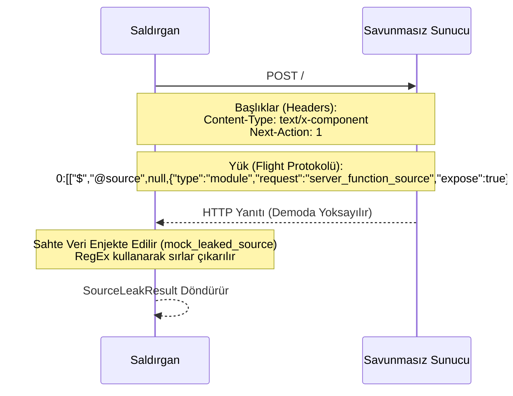
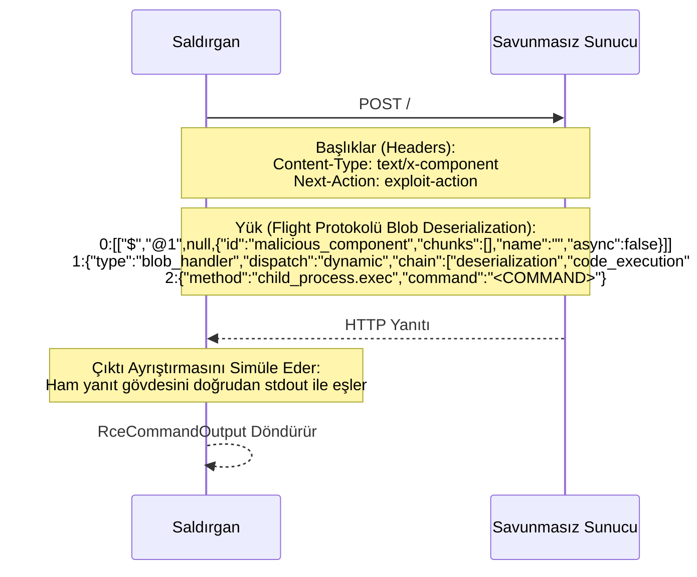
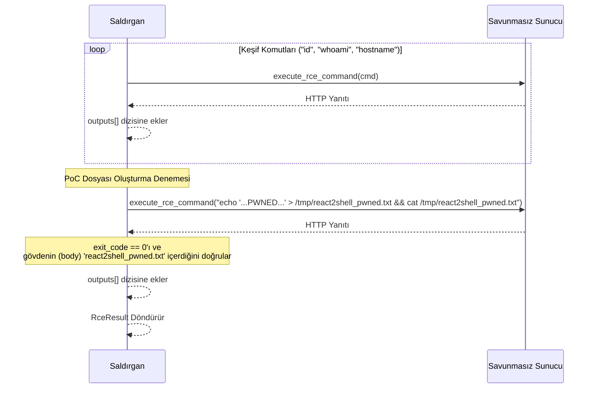

# React2Shell Simüle Edilmiş Fonksiyonlar ve Sahte Veri (Mock Data) Mantık Akışı

`src/react.rs` içindeki kaynak koduna dayanarak, bu araç, tam olarak silahlandırılmış (weaponized) bir sömürü (exploitation) aracı olmaktan çok, gösterim ve eğitim amaçlı tasarlanmış, sahte veriler veya simüle edilmiş mantık akışları kullanan çeşitli fonksiyonlar içerir.

---

## 1. `execute_source_leak` (Kaynak Kodu Sızıntısı Aşaması - CVE-2025-55183)

Bu fonksiyon, savunmasız bir Next.js/React sunucusundan kaynak kodunun çıkarılmasını simüle eder. Gerçek sunucu yanıtını ayrıştırmak (parsing) yerine, kod içine gömülü sahte (mock) veriler döndürür.

### Saldırı İsteği Akışı ve Diyagramı



### Veri Türleri ve Özellikler (Props)
```rust
/// Kaynak kodu sızıntı saldırısının sonucu.
pub struct SourceLeakResult {
    pub target: String,               // Hedef URL
    pub success: bool,                // Sızıntı girişiminin durumu
    pub bytes_leaked: usize,          // Sızdırılan içeriğin boyutu
    pub leaked_source: String,        // Sızdırılan ham kaynak kodu (Sahte)
    pub findings: Vec<SourceLeakFinding>, // Çıkarılan kimlik bilgileri/sırlar
}

/// Kaynak kodu sızıntısı analizinden elde edilen bir bulgu.
pub struct SourceLeakFinding {
    pub pattern: String,              // Tetiklenen Regex deseni
    pub matched: String,              // Eşleşen tam sır (secret)
    pub context: String,              // Çevresindeki kod bağlamı
}
```

### İçerilen Sahte Veriler
Fonksiyon, sahte hassas kimlik bilgileri içeren sızdırılmış bir JavaScript modülünü simüle eden bir `mock_leaked_source` dizesi tanımlar:
- `DB_CONNECTION` (PostgreSQL bağlantı dizesi)
- `API_SECRET_KEY` (Stripe / R2S gizli anahtarı)
- `JWT_SIGNING_KEY`
- `INTERNAL_API_TOKEN`

### Mantık Akışı
1. **İstemciyi Başlat:** Hedef URL'nin sonundaki eğik çizgileri temizler ve 10 saniyelik zaman aşımına sahip bir HTTP istemcisi oluşturur.
2. **Yükü (Payload) Hazırla:** Flight protokolü istek yükünü oluşturmak için `craft_leak_payload()` fonksiyonunu çağırır.
3. **İsteği Gönder:** Oluşturulan yük ve belirli başlıklarla (headers) hedefe bir POST isteği gönderir.
4. **Gerçek Yanıtı Yoksay:** HTTP yanıtı `_resp` değişkenine atanır ve tamamen yoksayılır.
5. **Sahte Veri Enjekte Et:** `mock_leaked_source` değişkeni, simüle edilmiş sızdırılmış kaynak koduyla başlatılır.
6. **Sırları Çıkar:** Sahte veriyi bilinen düzenli ifade desenlerine (`SOURCE_LEAK_PATTERNS`) karşı ayrıştırarak hassas bulguları tespit etmek için `extract_sensitive_data(mock_leaked_source)` çağrılır.
7. **Sonucu Döndür:** Başarılı olduğunu belirten bir `SourceLeakResult` döndürür.

---

## 2. `execute_rce_command` (Uzaktan Kod Çalıştırma Aşaması - CVE-2025-55182)

Bu fonksiyon Uzaktan Kod Çalıştırma (RCE) için bir gösterim (demo) uygulaması olarak çalışır. Hedefe gerçek bir HTTP isteği *gönderse de*, kaynak kodunda bunun "Demo modu: eğitim simülasyonu için yerel olarak yürütülür" olduğu açıkça belirtilmiştir.

### Saldırı İsteği Akışı ve Diyagramı



### Veri Türleri ve Özellikler (Props)
```rust
/// Tek bir RCE komutunun yürütülmesinden elde edilen çıktı.
pub struct RceCommandOutput {
    pub command: String,              // Enjekte edilen kabuk (shell) komutu
    pub output: String,               // Komut çıktısı (Stdout)
    pub exit_code: i32,               // HTTP başarısı için 0, hata için 1, ağ hatası için -1
    pub error: String,                // Yakalanan HTTP veya Ağ hatası dizesi
}
```

### Simüle Edilen Yönü
(Gerçek bir sömürüde (exploit) gerekecek olan) Karmaşık, seri durumdan çıkarılmış (deserialized) bir Flight protokolü yanıtını ayrıştırmak yerine, hedefin ham HTTP yanıt gövdesinin (body) doğrudan komutun standart çıktısını (stdout) içerdiğini varsayarak RCE'yi simüle eder.

### Mantık Akışı
1. **İstemciyi Başlat:** Hedef URL'yi biçimlendirir ve 10 saniyelik zaman aşımına sahip bir HTTP istemcisi oluşturur.
2. **Yükü (Payload) Hazırla:** Enjekte edilen kabuk komutunu içeren serileştirilmiş bir `blob_handler` Flight yükü üreten `build_rce_payload(command)` çağrılır.
3. **İsteği Gönder:** `Next-Action: exploit-action` başlığını (header) kullanarak hedefe bir POST isteği gönderir.
4. **Çıktı Ayrıştırmasını Simüle Et:**
   - İstem başarılı olursa (ağ hatası yoksa), ham yanıt metnini okur ve komutun çıktısı olarak kabul eder. HTTP durumu başarılı (2xx) bir kod ise `exit_code: 0` olarak ayarlar, aksi takdirde `1` yapar.
   - İstem başarısız olursa (ağ hatası/zaman aşımı), `exit_code: -1` döndürür ve hata mesajını içerir.
5. **Sonucu Döndür:** Simüle edilen yürütme ayrıntılarını içeren bir `RceCommandOutput` yapısı (struct) döndürür.

---

## 3. `execute_rce` (RCE Orkestrasyonu)

Bu fonksiyon RCE aşamasını koordine eder (orchestrates). Bir saldırganın sömürü sonrası (post-exploitation) akışını göstermek için `execute_rce_command`'a güvenir ve kod içine gömülü (hardcoded) sahte komutlar kullanır.

### Saldırı İsteği Akışı ve Diyagramı



### Veri Türleri ve Özellikler (Props)
```rust
/// RCE yürütme sonucu.
pub struct RceResult {
    pub target: String,               // Hedef URL
    pub success: bool,                // Herhangi bir komut başarıyla yürütüldüyse True
    pub poc_file_created: bool,       // PoC test dosyasının oluşturulduğu doğrulandıysa True
    pub command_outputs: Vec<RceCommandOutput>, // Tüm komut çıktılarının dizisi (Array)
}
```

### İçerilen Sahte Veriler
- **Koda Gömülü (Hardcoded) Keşif Komutları:** `["id", "whoami", "hostname"]`
- **Koda Gömülü Proof of Concept (PoC) Komutu:** `echo 'React2Shell ... PWNED' > /tmp/react2shell_pwned.txt && cat ...`

### Mantık Akışı
1. **Keşif Komutlarını Dön (Iterate):** Temel UNIX keşif komutlarından oluşan önceden tanımlanmış liste üzerinden döngü oluşturur.
2. **Yürüt ve Sakla:** Her komut için `execute_rce_command` çağrılır ve simüle edilen çıktıları saklar.
3. **PoC Yazma Denemesi:** `/tmp/react2shell_pwned.txt` konumuna bir metin dosyası yazmak ve hemen okumak (cat) için dinamik olarak zaman damgalı bir `echo` komutu üretir.
4. **PoC'yi Doğrula:** PoC komutunun çıkış kodunun `0` olup olmadığını ve çıktının açıkça beklenen dosya adını içerip içermediğini kontrol eder.
5. **Sonucu Döndür:** Herhangi bir komutun başarılı olup olmadığını, PoC'nin başarıyla oluşturulup oluşturulmadığını ve komut çıktılarının tam listesini belirten bir `RceResult` döndürür.

---

## 4. Saldırı Yüzeyi ve Sömürü Vektörleri (CVE-2025-55182 / CVE-2025-55183)

### Nereden Saldırıyoruz?
Güvenlik açığı (vulnerability), **React Server Components (RSC)** ayrıştırma (parsing) mantığının derinliklerinde yer alır; özellikle "Flight protokolünün" gelen bileşen yüklerini güvenli olmayan bir şekilde (insecurely) seri durumdan çıkarmasında (deserialize).
Server Actions veya RSC işlemelerini (renders) işleyen arka uç (backend) uç noktalarına (endpoints) saldırıyoruz. Tipik bir Next.js App Router uygulamasında bu, Flight yüklerini kabul eden ve işleyen Uygulama rotalarını veya API rotalarını hedeflemek anlamına gelir.

### TÜM POST İsteklerini Tespit Etmeli miyiz?
Hayır, site genelindeki *her* `POST` isteğini izlemek veya tespit etmek kesinlikle gerekli değildir. Özellikle RSC mimarisiyle etkileşime giren uç noktaları arıyoruz.
Bununla birlikte, Next.js Server Actions işlemlerini web sayfalarının kendileriyle tamamen aynı URL'lerde işlediği için, **bir Next.js App Router sitesindeki geçerli hemen hemen her URL bir saldırı vektörü olarak kullanılabilir**. Bir saldırganın belirli bir "API uç noktası" bulmasına gerek yoktur; yalnızca geçerli bir sayfa URL'sini alabilir, doğru RSC başlıklarını (headers) ekleyebilir ve bir `POST` isteği gönderebilir. Dahili Next.js yönlendiricisi (router) bu başlıkları yakalar ve kötü amaçlı yükü doğrudan savunmasız ayrıştırıcıya yönlendirir.

### Hangi POST İstekleri Sömürülebilir (Exploitable)?
Bir `POST` isteği aşağıdaki koşulları karşılıyorsa sömürülebilir bir vektör haline gelir:
1. **Savunmasız Ortam:** Hedef uygulama, Next.js ve React'in savunmasız bir kombinasyonunu (ör. React 19 ile eşleştirilmiş Next.js 15.x) çalıştırıyor.
2. **App Router Aktif:** Uygulama Next.js App Router mimarisini kullanıyor, yani RSC aktif olarak etkinleştirilmiş.
3. **Flight Protokol Başlıkları:** İstek, sunucuya Flight ayrıştırıcısını devreye sokması için açıkça talimat vermelidir. Bu, aşağıdaki gibi belirli başlıkların eklenmesiyle elde edilir:
   - `Content-Type: text/x-component`
   - `Next-Action: <action_id>` (Eylem Kimliği (Action ID) doğrulaması gerçekleşmeden *önce* ilk seri durumdan çıkarma (deserialization) aşamasını tetiklemek için uydurma, rastgele veya genel bir Eylem Kimliği bile yeterlidir).
   - `RSC: 1`

Arka uç (backend), yoğun şekilde iç içe geçmiş veya kötü amaçlı olarak hazırlanmış JSON benzeri bir Flight yükünü (iç işleyicileri - örneğin `blob_handler` - suistimal ederek) ayrıştırmaya çalıştığında, güvenli olmayan seri durumdan çıkarma (insecure deserialization) güvenlik açığı tetiklenir. Bu, herhangi bir standart girdi doğrulamasının engellemesine fırsat kalmadan sunucuyu rastgele kod yürütmeye (RCE) veya kaynak dosyalarını sızdırmaya zorlar.
